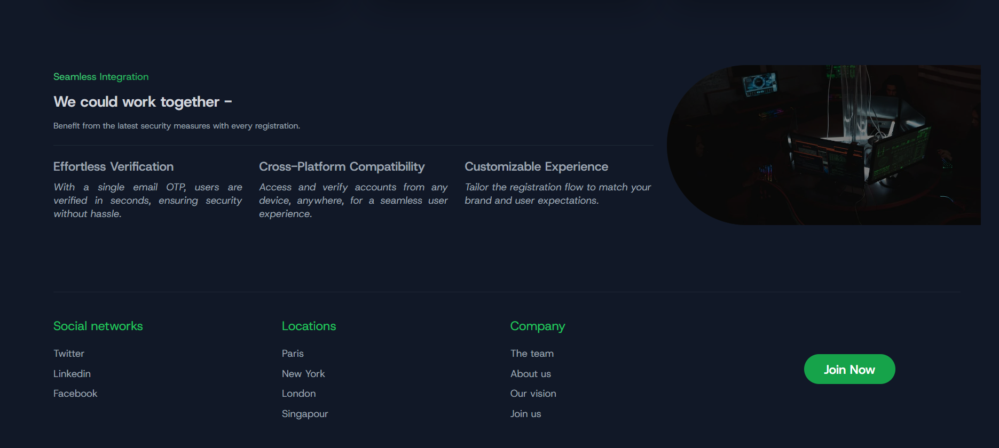
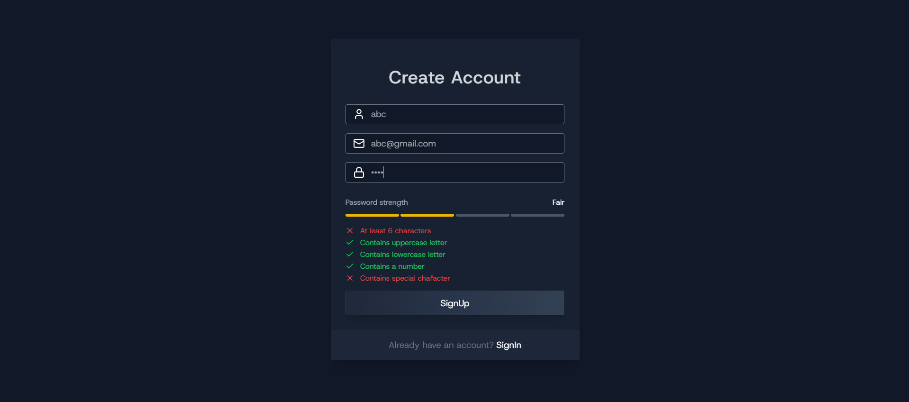
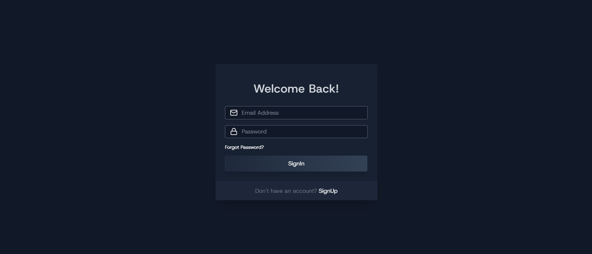

**Advanced Authentication Project**

***🌟 About the Project***

This project is a full-stack MERN application that focuses on advanced authentication functionality. It provides a secure and seamless user experience, incorporating modern features like email OTP verification, robust password validation, and convenient account recovery options.

The application is designed to prioritize both security and user convenience, with a beautifully styled frontend and a robust backend.

*🌟 Features*\
User Registration with Email OTP Verification.\
Users must verify their email address via OTP to complete the signup process, enhancing account security.

**Advanced Password Validation**

A visually appealing password validation component guides users in creating strong, secure passwords.

**Forgot Password and Reset Password Functionality**
Simplifies account recovery with options to reset passwords securely.

**State Management with Zustand**\
Efficient and lightweight state management for a smooth and responsive frontend.

**Tailwind CSS for Styling**\
A modern, utility-first CSS framework ensures a clean and responsive UI.

**🛠️ Technologies Used**\

*Backend:*\
1. Express.js: Fast and minimalist web framework for Node.js.
2. MongoDB with Mongoose: A schema-based solution to model application data.
3. JSON Web Tokens (JWT): Secure authentication and session management.
4. bcrypt.js: Hashing library for secure password storage.
5. dotenv: Manage environment variables with ease.
6. crypto: Cryptographic utilities for secure token generation.
7. cookie-parser: Parse cookies to manage sessions securely.
8. CORS: Enable cross-origin resource sharing for secure communication.
9. Mailtrap: For sending email OTPs during the signup process.

*Frontend:*\
1. React.js: A powerful library for building dynamic user interfaces.
2. Zustand: Lightweight and flexible state management.
3. Tailwind CSS: For modern, responsive, and visually appealing designs.
4. Vite: A fast and modern build tool for optimized development.

**🎯 Key Features in Action**\
Signup Process with Email Verification.

**User registers and receives an OTP via email.**\
The OTP is verified to activate the account.\
Password Validation Component

**Real-time feedback helps users create strong passwords.**\
Ensures compliance with security best practices.
Forgot and Reset Password

**Initiates password reset through email.**\
Users can securely update their passwords.
Optimized State Management

**Zustand ensures smooth transitions and data handling across the app.**

**Screenshots**

